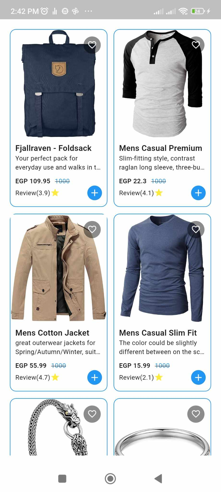

# Elevate App

The **Elevate App** is a Flutter-based application that displays a list of products fetched from a remote API. It follows modern development best practices by using the **MVVM architecture**, **Cubit** for state management, and the **Repository pattern** to handle data fetching. The app ensures clean code separation and easy maintainability by leveraging **GetIt** for dependency injection.

## Features
- **Fetch and display products:** Products are dynamically fetched from a remote API and displayed in a clean, responsive layout.
- **Simple and clean UI:** A minimalistic interface that focuses on product details.
- **Cubit for state management:** Efficient and easy-to-use state management with Cubit.
- **GetIt for dependency injection:** Ensures modular code and testability through easy management of dependencies.

## Tech Stack
- **Flutter:** A cross-platform framework for building natively compiled applications for mobile.
- **Cubit (State Management):** Lightweight state management solution.
- **GetIt (Dependency Injection):** Service locator for managing dependencies.
- **Repository Pattern:** Provides a clear abstraction for data fetching and manipulation.

## Screenshots
Here’s a look at the home screen displaying the list of products:

## Getting Started

### Prerequisites
- Flutter SDK installed on your system.
- Internet connection to fetch product data from the API.

